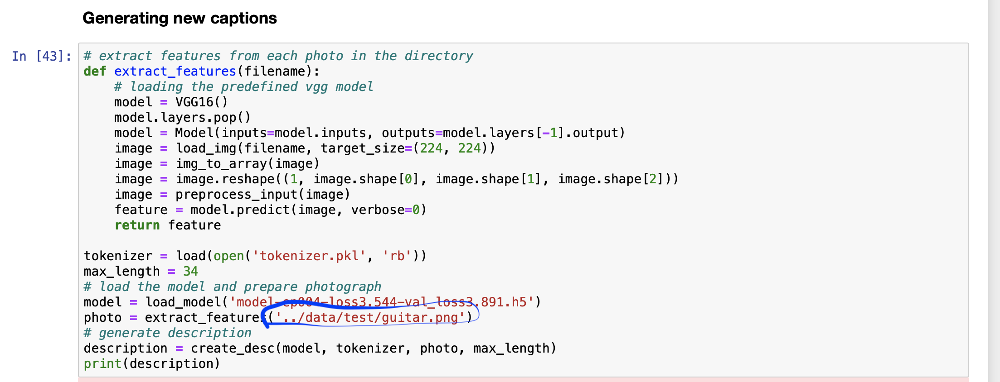

Image_Captioning
==============================

Aim of this project is to develop a deep learning model to generate a caption, given an image.

## Few details about the data folder

Data directory consists of two folders Processed and test.

In the "processed" folder, we have our flickr8k dataset. More in depth about this is in the report.doc

In the "test" folder, we have few  images to test our model. We give this test image path in new caption generation part of our code 

## About the notebooks folder

ImagesCaptioning.ipynb --> consists of source code
description.txt --> consists of dict of descriptions with descriptions as key and captions as values. 
tokenizer.pkl --> We created the tokenizer and saved it to a file named tokenizer.pkl so that we can load it quickly whenever we need it without needing the entire Flickr8K dataset. 
model.png --> A plot to visualize the structure of the network that better helps understand the two streams of input.
features.pkl -->  Extracted features stored in ‘features.pkl‘ for later use 

## About the Reports folder

We have all information about this project in the report.doc

